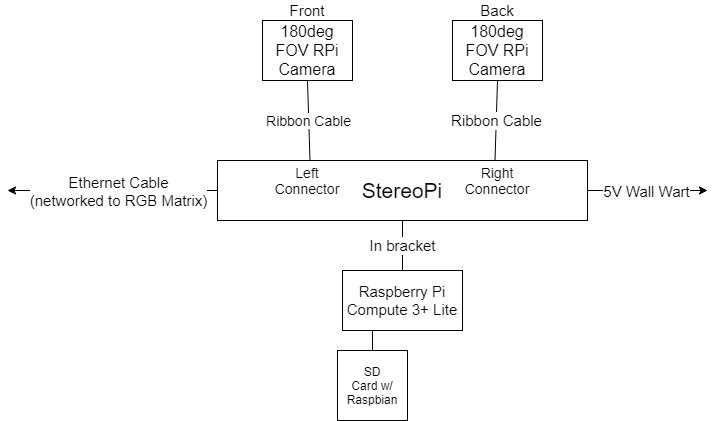

# Distributed Vision Visualization

## Overview
This is the ECE 4180 Final Project submitted by Joe Spall and Sarkis Ter Martirosyan. The goal for this project is to read multiple [April Tags](https://april.eecs.umich.edu/software/apriltag) using a [StereoPi](https://stereopi.com/) vision module to identify the location of those April Tags relative to the cameras. That estimation is transmitted wirelessly over TCP to a server hosted by a [Raspberry Pi Zero W](https://www.raspberrypi.org/products/raspberry-pi-zero-w/?resellerType=home) that then displays the location of the April Tags on a HUB75 64x64 RGB Matrix. 

## Parts List
### Server/RGB-Matrix Module

| Part |
| ---- |
| [Raspberry Pi Zero W](https://www.raspberrypi.org/products/raspberry-pi-zero-w/?resellerType=home) | 
| [Micro SD Card](https://www.amazon.com/SanDisk-Ultra-microSDHC-Memory-Adapter/dp/B08GYBBBBH/ref=sr_1_4?dchild=1&keywords=micro+card&qid=1605826281&s=electronics&sr=1-4) |
| [Pi Cobbler+](https://www.adafruit.com/product/914) | 
| [Female-to-Male Jumper Wires](https://www.amazon.com/GenBasic-Solderless-Dupont-Compatible-Breadboard-Prototyping/dp/B01L5UKAPI/ref=sr_1_4?dchild=1&keywords=male+to+female+jumper+wires&qid=1605817419&sr=8-4) |
| [RGB Matrix Bonnet for Raspberry Pi](https://www.adafruit.com/product/3211) |
| [64x64 RGB Neopixel Display](https://www.adafruit.com/product/3649) |
| [5V 10A switching power supply](https://www.adafruit.com/product/658) |

### Client/Camera Module

| Part |
| ---- |
| [Raspberry Pi Compute 3+ Lite](https://www.raspberrypi.org/products/compute-module-3-plus/?variant=compute-module-3plus-lite&resellerType=home) |
| [Micro SD Card](https://www.amazon.com/SanDisk-Ultra-microSDHC-Memory-Adapter/dp/B08GYBBBBH/ref=sr_1_4?dchild=1&keywords=micro+card&qid=1605826281&s=electronics&sr=1-4) |
| 2x [Arducam Fisheye Camera](https://www.amazon.com/gp/product/B013JWEGJQ/ref=ppx_yo_dt_b_asin_title_o07_s00?ie=UTF8&psc=1) |
| 2x [50cm FFC Ribbon Cable](https://www.amazon.com/gp/product/B089LM5D1T/ref=ppx_yo_dt_b_asin_title_o00_s00?ie=UTF8&psc=1) |
| [SteroPi (Standard Edition)](https://www.pishop.us/product/stereopi-standard-edition/) |
| [3D Printed Stand for Camera Mounting](https://wiki.stereopi.com/index.php?title=StereoPi_Mechanics#Cases_for_3D_print) |
| [5V 2A switching power supply](https://www.adafruit.com/product/276)

## Setup and Installation

### Server/RGB-Matrix Module

#### Wiring
The wiring on the client side is relatively straight forward. The Pi Zero W must be inserted into the Pi Cobbler+ so that the SD Card on the Raspberry Pi is aligned with the words ``Cobbler+`` on the Pi Cobbler PCB. From there, the Pi Cobbler+ must be hooked up to the RGB Matrix Bonnet so that the pins on the Raspberry Pi line up with the pins on the Bonnet as shown [here](https://learn.adafruit.com/assets/51032). Connect the 64x64 RGB Display to the Bonnet as shown in the tutorial for whatever RGB display you buy. The final step is to solder pins 4 and 18 on the RGB Matrix Bonnet.  

#### Code
The first step in setting up the code is to follow the installation instructions for the Bonnet library shown [here](https://learn.adafruit.com/adafruit-rgb-matrix-bonnet-for-raspberry-pi?view=all#driving-matrices). When it comes to select between quality and convenience, please select the quality option. From there clone in the server branch of this repository. You can get this branch onto your Raspberry Pi Zero W server by running these commands: 

```bash
git clone https://github.com/joe-spall/distributed-vision.git
git checkout server 
```

From there you can start the server running by executing the file [final_server.py](https://github.com/joe-spall/distributed-vision/blob/server/rpi-rgb-led-matrix/bindings/python/samples/final_server.py) located in the directory `distributed-vision/rpi-rgb-led-matrix/bindings/python/samples/final_server.py`. Change the variable `my_ip` in `final_server.py` to reflect the actual IP of the Raspberry Pi Zero W on your local network. To run the server properly for a 64x64 RGB Matrix, you need to use this bash command:

```bash
sudo ./final_server.py -r 64 --led-cols 64
```

After this, the server should be up and waiting for a connection from the client. 

#### Photos
These are some sample photos of our setup. 

| Example Photos |
| -------------- |
| [Power Supply Brick](https://photos.google.com/share/AF1QipNsIqyeEHIrXT9VP8A1IKr34ptzQHY_JPHF02mI6lNcXrIQbD_YwltlO2YAApMyZw/photo/AF1QipOaRkycxnqihjz6Owt76IpKrcNicT8PogM8LFIy?key=M2FtRUh1cS1XQUVLdS1ZVDlhTDZ0bGZsQkJxM1FB) |
| [Raspberry Pi Zero W](https://photos.app.goo.gl/KHfsGGmuaw87fhBf7) |
| [Raspberry Pi connected to RGB Matrix Bonnet](https://photos.app.goo.gl/cqnCgESpTngZwZeS9) |
| [RGB Matrix Bonnet](https://photos.google.com/share/AF1QipMsmtNqdN-5M4sXHGo1j6Kf1vuD9z6663KYCGvuELj4ML6NbWCxB8GrgW7piCADYg/photo/AF1QipNQNMJdxwCsRYsph6B9GGWgMzhMmoAychx4W5IL?key=YVVzVjRDWVJlb01Eay1IWDVFVE8zVno3c2xxSTFn) |

### Client/Camera Module

#### Wiring / Assembly
The following is a list of steps to prepare the initial hardware setup:
1. Install the Raspberry Pi Compute module in the bottom of the SteroPi board using the clip system
2. Plug in the two cameras, with the blue tabs facing away from the 40-pin header
3. On a micro SD card, install Raspbian
4. Add the two wire plugs to the 5V port
5. Attach to the 5V 2A power supply and turn on the power switch
6. Plug in an Ethernet capble for network access
7. Label the left camera facing the 40 pin header as the front and the right as the back camera

#### Schematic



#### Software
The following is a list of steps to prepare the initial software setup:
1. SSH into the Raspberry Pi and run:
```bash
sudo apt update
sudo apt full-upgrade
sudo apt install realvnc-vnc-server realvnc-vnc-viewer
```
2. Run `sudo raspi-config`. While running, go to Interface Options and enable Camera and VNC (for convenience)
3. Install VNC viewer on your local computer and connect to the Raspberry Pi
4. Install [opencv from source](https://www.learnopencv.com/install-opencv-4-on-raspberry-pi/)
5. Clone the `distributed-vision` repo and checkout the `camera-detection` branch
```bash
git clone https://github.com/joe-spall/distributed-vision.git
git checkout camera-detection
```

#### Preparing the Camera Model
Before running the code, a model for the cameras has to be generated. This involves taking many photos using the [checkerboard](https://github.com/opencv/opencv/blob/master/doc/pattern.png) to provide image rectification for transforming the view from curved angles of the fisheye lens to more straight angles. When using the checkerboard, it is best to attach the printout to a rigid surface like cardboard, as curves of the board will negatively impact the ability to determine the camera rectification parameters. The steps to do so involve the following:
1. Navigate to the `src` directory
2. Compile the C++ code by running the following command:
```bash
g++ /home/pi/distributed-vision/src/cal_collection.cpp -o /home/pi/distributed-vision/bin/cal_collection.bin -I/usr/local/include/opencv4 -L/usr/local/lib -lopencv_core -lopencv_highgui -lopencv_imgcodecs -lopencv_imgproc -lopencv_calib3d
```
3. Run the program with the following command:
```bash
raspividyuv -3d sbs -w 1280 -h 480 -fps 40 --luma -t 0 -n -o - | /home/pi/distributed-vision/bin/cal_collection.bin
```
4. The software will proceed to take 50 photos while you move around the scene with the checkerboard in different angles and orientations. Both cameras will capture data, so it is helpful to have another person assist with a second checkerboard as it is best to do the calibration in the final configuration of mounting.

After the images are captured, a program needs to process the images and generate the model for the camera transformation.

1. Navigate to the `src` directory
2. Compile the C++ code by running the following command:
```bash
g++ /home/pi/distributed-vision/src/calibration.cpp -o /home/pi/distributed-vision/bin/calibration.bin -I/usr/local/include/opencv4 -L/usr/local/lib -lopencv_core -lopencv_highgui -lopencv_imgcodecs -lopencv_imgproc -lopencv_calib3d
```
3. Run the program with the following command:
```bash
/home/pi/distributed-vision/bin/calibration.bin
```
4. The software will traverse through the captured calibration images and generate the model for the front and back camera.

#### Running the Program

The following will detail how to run the vision client:

1. Run the following commands in the `distributed-vision` folder to pull in the [AprilTag](https://github.com/AprilRobotics/apriltag) submodule:
```bash
git submodule init
git submodule update
```
2. Navigate to the `src` directory and copy the contents of `distributed_vision.cpp`
3. Navigate to the `apriltag/example` directory and paste the contents into opencv_demo.cc
4. Return to the `apriltag` and run the following command:
```bash
make
sudo make install
```
5. Finally, to run the program:
```bash
raspividyuv -3d sbs -w 640 -h 240 -fps 40 --luma -t 0 -n -o - | /home/pi/distributed-vision/apriltag/opencv_demo
```
6. The server should be run before starting the client, but it will attempt to reconnect after it is started regardless

| Example Photos |
| -------------- |
| [Full Vision Setup](https://github.com/joe-spall/distributed-vision/blob/main/imgs/full_vision.jpg) |
| [AprilTag Example](https://github.com/joe-spall/distributed-vision/blob/main/imgs/apriltag.jpg) |
| [Checkerboard](https://github.com/joe-spall/distributed-vision/blob/main/imgs/checkerboard.jpg) |
| [Front Camera](https://github.com/joe-spall/distributed-vision/blob/main/imgs/camera_front.jpg) |
| [StereoPi Enclosure](https://github.com/joe-spall/distributed-vision/blob/main/imgs/stereo_pi_enclosure.jpg) |

## Demonstration

For the demonstration, here are several videos that highlight the system tracking three April Tags in real-time. 

| Views | 
| ----- |
| [Dot Matrix Cam](https://youtu.be/hsFkJoQ_Yo8) |
| [Client Screen Capture Cam](https://youtu.be/FzzDqCPymg8) |
| [Physical April Cam Movement Cam](https://youtu.be/cZ3JV5UcapI) |
